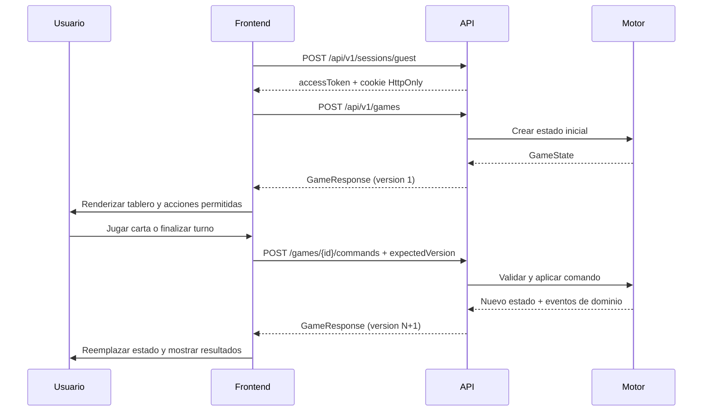
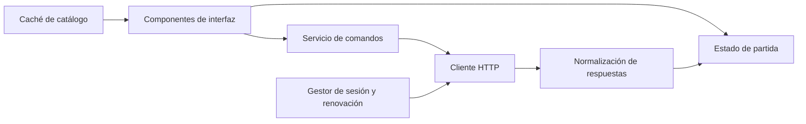

# Guía de integración del frontend

## 1. Propósito

Esta guía explica cómo interpretar el estado de una partida y cómo debe interactuar
un cliente web con la API de Colombia Ecosystems Game. El motor es la fuente de
verdad: el frontend presenta el estado, envía intenciones y renderiza la respuesta,
pero no calcula costos, producción, eventos, victorias ni derrotas por su cuenta.

Contrato completo: [`docs/api/openapi.yaml`](api/openapi.yaml).

## 2. Flujo general



## 3. Autenticación y sesión

### Crear una sesión

```http
POST /api/v1/sessions/guest
```

La respuesta contiene:

| Variable | Tipo | Uso en el frontend |
|---|---|---|
| `guestId` | `string` | Identidad anónima propietaria de las partidas. No debe editarse. |
| `sessionId` | `string` | Identificador de sesión para diagnóstico. |
| `accessToken` | `string` | JWT enviado como `Authorization: Bearer <token>`. |
| `tokenType` | `"Bearer"` | Tipo de autenticación. |
| `accessExpiresAt` | fecha ISO 8601 | Permite renovar antes de que expire el JWT. |
| `refreshExpiresAt` | fecha ISO 8601 | Límite de renovación de la sesión. |

La API también establece la cookie HttpOnly `amazonas_refresh`. El JavaScript no
debe intentar leerla. En desarrollo con orígenes diferentes, las solicitudes deben
usar `credentials: "include"`.

```ts
const response = await fetch(`${baseUrl}/api/v1/sessions/refresh`, {
  method: "POST",
  credentials: "include",
});
```

El `accessToken` debe mantenerse preferiblemente en memoria. Si una solicitud
responde `401`, el cliente puede intentar una sola renovación y repetir la solicitud.
Si la renovación falla, debe crear una nueva sesión o volver a una pantalla de inicio.

## 4. Respuesta principal de una partida

Los endpoints de creación, consulta y comandos devuelven `GameResponse`.

### Metadatos

| Variable | Tipo | Significado | Uso visual o técnico |
|---|---|---|---|
| `id` | `string` | Identificador único `game_*`. | Ruta, caché y selección de partida. |
| `version` | `number` | Versión persistida del estado. | Enviar como `expectedVersion` en el siguiente comando. |
| `createdAt` | fecha ISO 8601 | Momento de creación. | Listados e historial. |
| `updatedAt` | fecha ISO 8601 | Última modificación. | Ordenar partidas y detectar cambios. |
| `state` | `GameView` | Estado público completo. | Fuente principal del tablero. |
| `availableActions` | `AvailableActions` | Validación anticipada de acciones. | Habilitar botones y explicar bloqueos. |
| `domainEvents` | `DomainEvent[]` opcional | Consecuencias del último comando. | Animaciones, mensajes y registro de actividad. |

### Control de concurrencia con `version`

Cada comando debe usar la versión que acompaña al estado actualmente renderizado:

```json
{
  "type": "end_turn",
  "expectedVersion": 4
}
```

Si otro comando modificó la partida, la API responde `409 VERSION_CONFLICT` con
`details.currentVersion`. El frontend debe volver a consultar la partida, reemplazar
su estado local y pedir al usuario que repita la acción. No debe incrementar la
versión local manualmente.

## 5. Variables de `state`

### Estado básico

| Variable | Tipo | Significado | Comportamiento del frontend |
|---|---|---|---|
| `schemaVersion` | `number` | Versión del formato del estado. | Registrar para compatibilidad; no mostrar como mecánica. |
| `scenarioId` | `string` | Escenario activo, por ejemplo `amazonas_mvp`. | Seleccionar textos, imágenes y tema del escenario. |
| `round` | `number` | Ronda actual; una partida nueva comienza en `0`. | Mostrar en el encabezado del tablero. |
| `phase` | `GamePhase` | Fase que limita las acciones posibles. | Cambiar controles y navegación. |

Fases:

| Valor | Significado | Interfaz recomendada |
|---|---|---|
| `decision` | Turno normal. | Mostrar cartas, eventos y botón de finalizar turno. |
| `discard_required` | La mano superó el límite. | Abrir selección de descarte y bloquear las demás acciones. |
| `finished` | Existe victoria o derrota. | Bloquear comandos y mostrar el resultado final. |

### Recursos

`state.resources` contiene enteros no negativos:

| Variable | Significado | Uso principal |
|---|---|---|
| `money` | Capacidad económica. | Pagar cartas, soluciones y consumo de Población. |
| `people` | Capacidad humana y bienestar. | Costos, soluciones y condiciones de victoria social. |
| `land` | Territorio disponible. | Activación territorial, proyectos y soluciones. |

El frontend debe mostrar el costo de una carta desde el catálogo, pero debe usar
`availableActions.cards[cardId]` para decidir si realmente puede jugarse.

### Ambiente

| Variable | Tipo | Significado | Presentación recomendada |
|---|---|---|---|
| `deforestation` | `number` | Medidor ambiental global entre `0` y `3000`. | Barra con umbrales y valor numérico. |
| `temperatureLabel` | `string` | Etiqueta derivada de la deforestación. | Indicador informativo; no es un recurso gastable. |
| `tippingPointsCrossed` | `number[] \| null` | Umbrales ambientales ya cruzados. | Marcar umbrales activados y evitar anunciarlos dos veces. |

La derrota ambiental ocurre al llegar a `3000`. Los valores concretos de los
tipping points se obtienen con `GET /api/v1/catalog`.

### Sectores

`state.sectors` es un mapa indexado por ID de sector:

```ts
type SectorId = "industry" | "population" | "territory" | "ecosystems";
```

Cada sector contiene:

| Variable | Tipo | Significado |
|---|---|---|
| `active` | `boolean` | Define si el sector avanza y produce. |
| `cycleProgress` | `number` | Progreso acumulado hacia su siguiente producción. |
| `activeCards` | `string[] \| null` | Cartas permanentes asociadas al sector. |

La definición del catálogo aporta `cycleTarget`, `baseAdvance`, `production` y
`environmentImpact`. La interfaz puede mostrar el progreso como:

```text
cycleProgress / cycleTarget
```

Al finalizar una ronda, un sector activo avanza:

```text
baseAdvance + min(flechas de cartas activas, 4)
```

Al alcanzar `cycleTarget`, produce, descuenta el objetivo y conserva el sobrante.
Un sector puede producir más de una vez si acumula avance suficiente. El frontend
no debe predecir el resultado final: debe animar lo indicado por `domainEvents` y
el nuevo estado recibido.

### Zonas de cartas

| Variable | Tipo | Significado | Interfaz recomendada |
|---|---|---|---|
| `hand` | `string[]` | IDs de cartas en la mano. | Resolver cada ID contra el catálogo y renderizar la carta. |
| `deckCount` | `number` | Cantidad restante; el orden es privado. | Mostrar contador, nunca cartas futuras. |
| `discard` | `string[] \| null` | Acciones usadas y cartas descartadas. | Pila o historial consultable. |
| `policies` | `string[] \| null` | Políticas permanentes activas. | Área de políticas del tablero. |
| `projects` | `string[] \| null` | Proyectos permanentes activos. | Área de proyectos del tablero. |
| `milestones` | `Record<string, boolean>` | Hitos persistentes alcanzados. | Progreso de rutas de victoria. |

La API expone IDs, no definiciones duplicadas. El frontend debe cargar el catálogo
una vez y construir índices:

```ts
const cardsById = Object.fromEntries(catalog.cards.map((card) => [card.id, card]));
const eventsById = Object.fromEntries(catalog.events.map((event) => [event.id, event]));
const sectorsById = Object.fromEntries(catalog.sectors.map((sector) => [sector.id, sector]));
```

### Eventos de la partida

| Variable | Tipo | Significado | Interfaz recomendada |
|---|---|---|---|
| `active` | `ActiveEvent[] \| null` | Eventos actualmente en juego. | Panel con nombre, contador y solución. |
| `resolved` | `string[] \| null` | IDs de eventos solucionados. | Historial o indicadores de progreso. |
| `queuedCount` | `number` | Eventos pendientes que aún no se muestran. | Contador de presión futura, sin revelar IDs. |
| `territorialFailures` | `number` | Crisis territoriales expiradas. | Indicador de riesgo de derrota territorial. |

Cada evento activo contiene:

| Variable | Tipo | Significado |
|---|---|---|
| `id` | `string` | ID para consultar su definición en el catálogo. |
| `roundsRemaining` | `number` | Turnos restantes antes de expirar y aplicar consecuencias. |

La posibilidad de resolverlo se obtiene de
`availableActions.events[eventId]`, no comparando recursos manualmente.

### Presión social

`socialPressure` es un entero acumulativo. El valor `3` produce derrota social.
Debe mostrarse como un medidor de tres niveles y resaltarse cuando aumenta.

### Victoria

| Variable | Tipo | Significado |
|---|---|---|
| `completed` | `boolean` | Indica que se completó una ruta. |
| `route` | `string` opcional | ID de la ruta completada. |

Las rutas y sus requisitos están en `catalog.victoryRoutes`. Si `completed` es
`true`, la fase será final y el cliente debe mostrar el nombre de la ruta resuelto
desde el catálogo.

### Derrota

| Variable | Tipo | Significado |
|---|---|---|
| `gameOver` | `boolean` | Indica que la partida terminó en derrota. |
| `reason` | `string` opcional | Motivo programático de la derrota. |

La derrota se evalúa antes que la victoria. Si el estado incluye ambas señales,
el frontend debe priorizar la derrota.

## 6. Acciones disponibles

`availableActions` evita duplicar las reglas del motor en el cliente:

```ts
interface ActionAvailability {
  allowed: boolean;
  code?: string;
  message?: string;
}
```

| Variable | Contenido |
|---|---|
| `cards` | Disponibilidad de cada carta presente en la mano. |
| `events` | Disponibilidad de cada evento activo. |
| `discards` | Cartas que pueden descartarse en el estado actual. |
| `canEndTurn` | Permiso para finalizar el turno. |

Regla de interfaz:

```ts
const availability = game.availableActions.cards[cardId];
const disabled = !availability?.allowed || commandInFlight;
```

Cuando `allowed` sea `false`, el control debe permanecer visible pero deshabilitado.
El código permite producir un mensaje localizado:

| Código | Significado para el usuario |
|---|---|
| `INSUFFICIENT_RESOURCES` | Faltan recursos para pagar. |
| `REQUIREMENTS_NOT_MET` | Falta una carta o condición previa. |
| `SECTOR_INACTIVE` | El sector asociado todavía está cerrado. |
| `ACTIVE_CARD_LIMIT_REACHED` | El sector alcanzó su límite de cartas activas. |
| `EVENT_NOT_ACTIVE` | El evento ya no está disponible. |
| `HAND_LIMIT_EXCEEDED` | Primero se debe descartar. |
| `CARD_NOT_IN_HAND` | La carta ya no pertenece a la mano. |
| `GAME_ALREADY_OVER` | La partida terminó. |

`message` es útil para diagnóstico, pero el frontend debería traducir `code` a un
texto de producto consistente.

## 7. Comandos del juego

Todos se envían a:

```http
POST /api/v1/games/{gameId}/commands
Authorization: Bearer <accessToken>
Content-Type: application/json
```

### Jugar una carta

```json
{
  "type": "play_card",
  "cardId": "extractive_expansion",
  "expectedVersion": 1
}
```

### Resolver un evento

```json
{
  "type": "resolve_event",
  "eventId": "heat_wave",
  "expectedVersion": 2
}
```

### Descartar una carta

```json
{
  "type": "discard_card",
  "cardId": "community_health",
  "expectedVersion": 3
}
```

Debe ofrecerse principalmente durante `discard_required` y solo si
`availableActions.discards[cardId].allowed` es verdadero.

### Finalizar el turno

```json
{
  "type": "end_turn",
  "expectedVersion": 4
}
```

Debe habilitarse únicamente con `availableActions.canEndTurn.allowed`.

Mientras un comando está en curso, el frontend debe bloquear temporalmente los
controles de mutación para evitar dobles envíos. Tras una respuesta exitosa debe
reemplazar completamente `GameResponse`, no combinar manualmente recursos o cartas.

## 8. Eventos de dominio

Después de aplicar un comando, `domainEvents` describe lo que ocurrió:

```ts
interface DomainEvent {
  type: string;
  message: string;
  data?: Record<string, unknown>;
}
```

Se pueden usar para animaciones y notificaciones, por ejemplo producción sectorial,
activación de eventos o final de ronda. El estado nuevo sigue siendo la fuente de
verdad; perder una animación no debe dejar el tablero inconsistente.

## 9. Catálogo

```http
GET /api/v1/catalog
```

El catálogo contiene:

| Variable | Uso en el frontend |
|---|---|
| `scenario` | Nombre, límites y configuración general. |
| `cards` | Nombre, tipo, sector, costo, requisitos, flechas, efectos y texto. |
| `sectors` | Objetivos de ciclo, producción e impacto ambiental. |
| `events` | Nombre, categoría, duración y solución de eventos. |
| `tippingPoints` | Umbrales de deforestación y evento asociado. |
| `victoryRoutes` | Requisitos y progreso de cada ruta de victoria. |

Puede almacenarse en caché durante la sesión porque es contenido de solo lectura.
Cuando se incorporen nuevos escenarios, debe indexarse por `scenarioId` y evitar
suposiciones específicas del Amazonas en componentes compartidos.

## 10. Valores vacíos y `null`

Actualmente algunas listas Go vacías se serializan como `null`, mientras otras se
serializan como `[]`. El frontend debe normalizarlas en la capa de API:

```ts
function normalizeGame(game: GameResponse): GameResponse {
  game.state.environment.tippingPointsCrossed ??= [];
  game.state.cards.discard ??= [];
  game.state.cards.policies ??= [];
  game.state.cards.projects ??= [];
  game.state.events.active ??= [];
  game.state.events.resolved ??= [];

  for (const sector of Object.values(game.state.sectors)) {
    sector.activeCards ??= [];
  }

  game.domainEvents ??= [];
  return game;
}
```

No debe interpretarse `null` como “información oculta” en esos campos; significa
que la colección está vacía. `deckCount` y `queuedCount` sí ocultan deliberadamente
el contenido interno y solo exponen una cantidad.

## 11. Errores HTTP

Formato común:

```json
{
  "error": {
    "code": "VERSION_CONFLICT",
    "message": "La partida fue modificada por otra solicitud.",
    "requestId": "req_...",
    "details": {
      "currentVersion": 2
    }
  }
}
```

| Estado | Acción recomendada |
|---:|---|
| `400` | Mostrar error de solicitud; revisar payload o parámetros. |
| `401` | Renovar sesión una vez; si falla, iniciar una nueva. |
| `403` | Informar que la partida no pertenece a la sesión actual. |
| `404` | Retirar la partida de la caché y volver al listado. |
| `409` | Según el código: recargar versión o mostrar el bloqueo de regla. |
| `413` | No reenviar; el cuerpo supera el límite permitido. |
| `415` | Corregir `Content-Type` a `application/json`. |
| `500` | Mostrar error recuperable y registrar `requestId`. |

`requestId` debe enviarse a observabilidad y soporte, pero no es necesario mostrarlo
como texto principal al jugador.

## 12. Modelo TypeScript mínimo

```ts
type GamePhase = "decision" | "discard_required" | "finished";

interface GameResponse {
  id: string;
  version: number;
  createdAt: string;
  updatedAt: string;
  state: GameView;
  availableActions: AvailableActions;
  domainEvents?: DomainEvent[];
}

interface GameView {
  schemaVersion: number;
  scenarioId: string;
  round: number;
  phase: GamePhase;
  resources: { money: number; people: number; land: number };
  environment: {
    deforestation: number;
    temperatureLabel: string;
    tippingPointsCrossed: number[] | null;
  };
  sectors: Record<string, {
    active: boolean;
    cycleProgress: number;
    activeCards: string[] | null;
  }>;
  cards: {
    hand: string[];
    deckCount: number;
    discard: string[] | null;
    policies: string[] | null;
    projects: string[] | null;
    milestones: Record<string, boolean>;
  };
  events: {
    active: Array<{ id: string; roundsRemaining: number }> | null;
    resolved: string[] | null;
    queuedCount: number;
    territorialFailures: number;
  };
  socialPressure: number;
  victory: { completed: boolean; route?: string };
  defeat: { gameOver: boolean; reason?: string };
}

interface AvailableActions {
  cards: Record<string, ActionAvailability>;
  events: Record<string, ActionAvailability>;
  discards: Record<string, ActionAvailability>;
  canEndTurn: ActionAvailability;
}
```

## 13. Arquitectura recomendada del cliente



Responsabilidades:

- **Cliente HTTP:** URL base, JSON, token, cookies y errores comunes.
- **Gestor de sesión:** creación, renovación única y cierre.
- **Caché de catálogo:** definiciones por ID y contenido estático.
- **Estado de partida:** último `GameResponse` confirmado por el servidor.
- **Servicio de comandos:** construye payloads usando la versión actual.
- **Componentes:** renderizan datos y respetan `availableActions`.

## 14. Lista de verificación del frontend

- Usar `http://localhost:8081` cuando Jenkins ocupe el puerto `8080`.
- Crear o renovar una sesión antes de acceder a partidas.
- Enviar `Authorization: Bearer <accessToken>` en endpoints protegidos.
- Cargar e indexar el catálogo antes de renderizar IDs de contenido.
- Normalizar las listas `null` a arreglos vacíos.
- Mantener un solo `GameResponse` vigente por partida.
- Enviar siempre la `version` actual como `expectedVersion`.
- Deshabilitar acciones usando `availableActions`.
- Bloquear dobles envíos mientras un comando está pendiente.
- Reconsultar la partida después de `VERSION_CONFLICT`.
- Priorizar derrota sobre victoria al presentar el desenlace.
- Usar `domainEvents` para animaciones, no para reconstruir el estado.
